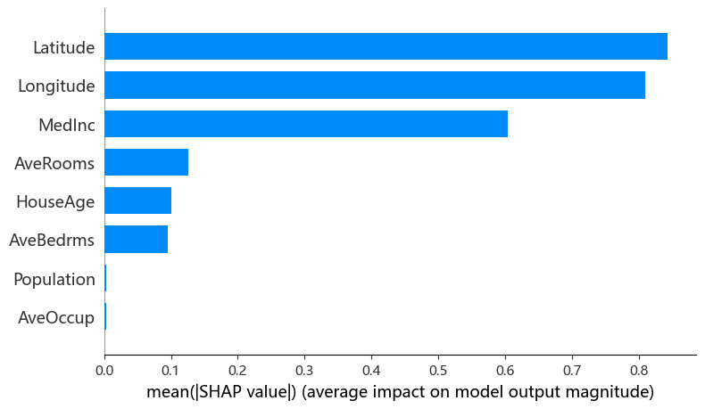

# 
加州房价数据集

# 
摘要

&emsp;基于scikit-learn里的加州房价数据集，进行数据分析——全变量 OLS、描述性统计、分布可视化、箱线图、散点图、相关性分析、VIF、经纬度房价散点图。

# 
1 数据来源与背景

&emsp;加州房价数据集源自 1990 年美国人口普查（U.S. Census） 数据，最初由 Pace, R. Kelley 和 Ronald Barry 在 1997 年的论文 "Sparse Spatial Autoregressions"（发表于 Statistics and Probability Letters）中构建并发布 。数据最初托管在卡内基梅隆大学的 StatLib 仓库中 。 
&emsp;该数据集是机器学习领域最常用的回归基准数据集之一，也是 sklearn 中 Boston 房价数据集被弃用后 的官方推荐替代方案 。

| 对比项 | 原始数据集（Kaggle/UCI版本） | sklearn版本 |
|:--------:|:------------------------------:|:-------------:|
| 特征总数 | 10个特征 + 1个目标变量 | 8个特征 + 1个目标变量 |
| 特征列表 | 1. `longitude` - 经度 2. `latitude` - 纬度 3. `housing_median_age` - 房屋年龄中位数 4. `total_rooms` - 总房间数 5. `total_bedrooms` - 总卧室数 6. `population` - 人口数 7. `households` - 家庭数 8. `median_income` - 收入中位数 9. `ocean_proximity` - 离海远近（类别型） 10. `median_house_value` - 房价中位数（目标） | 1. `MedInc` - 收入中位数（已归一化） 2. `HouseAge` - 房屋年龄 3. `AveRooms` - 平均房间数 4. `AveBedrms` - 平均卧室数 5. `Population` - 人口 6. `AveOccup` - 平均居住人数 7. `Latitude` - 纬度 8. `Longitude` - 经度 9. `target` - 房价中位数（目标，单位：10万美元） |
| 数据形式 | 原始数值，未标准化 | 预处理和标准化后的数值 |
| 类别特征 | 包含`ocean_proximity`（类别型），需one-hot编码 | 完全移除`ocean_proximity`，所有特征均为数值型 |
| 缺失值 | `total_bedrooms`存在少量缺失值 | 无缺失值，数据已清洗 |
| 特征计算方式 | - `total_rooms` - 直接使用总房间数 - `total_bedrooms` - 直接使用总卧室数 - `population` - 直接使用总人口数 - `households` - 直接使用家庭总数 | - `AveRooms` = `total_rooms / households` - `AveBedrms` = `total_bedrooms / households` - `AveOccup` = `population / households` - `MedInc` = `median_income`（已缩放） - `HouseAge` = `housing_median_age` - `Latitude` = `latitude` - `Longitude` = `longitude` |
| 目标变量单位 | 美元 | 10万美元（已缩放） |
| 使用便利性 | 需要特征工程和数据清洗 | 开箱即用，适合快速实验 |

# 
2 数据集基本概况

| 属性        | 说明                                       |
| :--------: | :---------------------------------------: |
| **样本数**   | 20,640 条                                 |
| **特征数**   | 8 个数值型预测特征 + 1 个目标变量                     |
| **数据粒度**  | 每条记录对应一个 **人口普查区块组（census block group）** |
| **区块组规模** | 通常包含 600 ~ 3,000 人                       |
| **缺失值**   | **无**                                    |
| **数据类型**  | 全部为 `float64`                            |

## 2.1 特征详解

| 特征名            | 全称                | 说明          | 单位/备注                      |
| :-------------: | :----------------: | :----------: | :-------------------------: |
| **MedInc**     | Median Income     | 区块组内家庭收入中位数 | 万美元/年（已做截断处理：上限 15，下限 0.5） |
| **HouseAge**   | Median House Age  | 区块组内房屋年龄中位数 | 年                          |
| **AveRooms**   | Average Rooms     | 每户平均房间数     | `总房间数 / 家庭数`               |
| **AveBedrms**  | Average Bedrooms  | 每户平均卧室数     | `总卧室数 / 家庭数`               |
| **Population** | Block Population  | 区块组总人口      | 人                          |
| **AveOccup**   | Average Occupancy | 每户平均居住人数    | `总人口 / 家庭数`                |
| **Latitude**   | Block Latitude    | 区块组纬度       | 度                          |
| **Longitude**  | Block Longitude   | 区块组经度       | 度                          |

注意：AveRooms、AveBedrms、AveOccup 是按户（household）平均的，因此在住户少、空房多的度假胜地等区块，这些值可能异常大 。

## 2.2 目标变量

| 属性              | 说明                                |
| :--------------: | :--------------------------------: |
| **MedHouseVal** | 区块组内房价中位数                         |
| **单位**          | **十万美元**（即目标值 4.526 表示 \$452,600） |
| **截断上限**        | 所有房价超过 \$500,000 的样本均被截断为 5.0     |

# 
3 探索性数据分析

## 3.1 建立多元线性回归模型
&emsp;未进行任何EDA探索性数据分析直接把自变量全部扔到多元线性回归模型中进行拟合。

### 3.1.1 模型摘要

| 指标 | 值 | 指标 | 值 |
|:------:|:-----:|:------:|:-----:|
| Dep. Variable | MedHouseVal | R-squared | 0.606 |
| Model | OLS | Adj. R-squared | 0.606 |
| Method | Least Squares | F-statistic | 3970 |
| Date | Sat, 25 Apr 2026 | Prob (F-statistic) | 0.00 |
| Time | 19:03:58 | Log-Likelihood | -22624 |
| No. Observations | 20640 | AIC | 4.527e+04 |
| Df Residuals | 20631 | BIC | 4.534e+04 |
| Df Model | 8 | Covariance Type | nonrobust |

&emsp;使用 Python 的 statsmodels 进行多元线性回归模型的模型摘要结果解析如下：
+ **Dep. Variable（因变量）**：MedHouseVal，即房价中位数，这是模型要预测的目标。
+ **Model（模型类型）**：OLS，普通最小二乘线性回归。
+ **Method（估计方法）**：Least Squares，使用最小二乘法求解系数。
+ **Date / Time**：模型运行的时间，用于记录结果版本。
+ **No. Observations（样本量）**：20640，共使用 20640 条数据参与建模。
+ **Df Model（模型自由度）**：8，表示模型中有 8 个自变量（不含截距项）。
+ **Df Residuals（残差自由度）**：20631，由样本量减去参数个数得到（20640 - 9 = 20631，9 个参数包含截距与 8 个自变量）。
+ **R-squared（R²）**：0.606。表示模型中的 8 个自变量联合起来，能够解释房价中位数 60.6% 的方差。这是一个中等偏上的拟合水平，对于房价这种受众多复杂因素影响的变量来说已较为可观。
+ **Adj. R-squared（修正 R²）**：0.606。与 R² 几乎一致，说明模型中几乎没有无效的冗余变量拖累整体解释力。由于样本量远大于自变量个数（20640 >> 8），修正 R² 对自变量的惩罚微乎其微，因此两者非常接近。
+ **F-statistic（F 统计量）**：3970。检验原假设“所有自变量的系数同时为零（即模型没有任何解释力）”。该值由回归均方除以残差均方计算得到，值越大说明模型整体解释力越强。
+ **Prob (F-statistic)（F 检验的 p 值）**：0.00（实际值极小，小于 0.0001）。在“所有系数全为零”的原假设下，几乎不可能得到如此大的 F 值，因此强烈拒绝原假设，表明模型整体高度显著，至少有一个自变量与因变量存在真实的线性关系。
+ **Log-Likelihood（对数似然）**：-22624。反映模型在给定数据下的拟合优度，数值越大（越接近 0）拟合越好。单独看数值没有绝对好坏，主要用于嵌套模型比较或计算信息准则。
+ **AIC（赤池信息准则）**：4.527e+04（约 45270）。由对数似然和参数个数共同决定，公式为$ AIC = -2 \times Log-Likelihood + 2 \times 参数个数$。用于非同模型之间的比较，AIC 越小模型越好。
+ **BIC（贝叶斯信息准则）**：4.534e+04（约 45340）。与 AIC 类似，但对参数个数的惩罚更重（$ BIC = -2 \times Log-Likelihood + ln(样本量) \times 参数个数 $）。在比较不同变量数量的模型时，BIC 更倾向于选择简洁的模型。
+ **Covariance Type（协方差矩阵类型）**：nonrobust，表明默认基于经典假设（误差独立、同方差、正态）计算标准误。

### 3.1.2 回归系数表

| 变量 | coef | std err | t | P>\|t\| | [0.025 | 0.975] |
|:------:|:------:|:---------:|:---:|:------:|:-------:|:-------:|
| const | -36.9419 | 0.659 | -56.067 | 0.000 | -38.233 | -35.650 |
| MedInc | 0.4367 | 0.004 | 104.054 | 0.000 | 0.428 | 0.445 |
| HouseAge | 0.0094 | 0.000 | 21.143 | 0.000 | 0.009 | 0.010 |
| AveRooms | -0.1073 | 0.006 | -18.235 | 0.000 | -0.119 | -0.096 |
| AveBedrms | 0.6451 | 0.028 | 22.928 | 0.000 | 0.590 | 0.700 |
| Population | -3.976e-06 | 4.75e-06 | -0.837 | 0.402 | -1.33e-05 | 5.33e-06 |
| AveOccup | -0.0038 | 0.000 | -7.769 | 0.000 | -0.005 | -0.003 |
| Latitude | -0.4213 | 0.007 | -58.541 | 0.000 | -0.435 | -0.407 |
| Longitude | -0.4345 | 0.008 | -57.682 | 0.000 | -0.449 | -0.420 |

&emsp;使用 Python 的 statsmodels 进行多元线性回归模型的回归系数结果解析如下：
+ **coef（回归系数）**：在其他自变量保持不变的条件下，该自变量每变动一个单位，因变量平均变动的数量。正号表示正向影响，负号表示负向影响。
示例解读：
  + MedInc（收入中位数）的系数为 0.4367，意味着控制其他因素后，收入每提高 1 个单位，房价中位数预计上涨约 0.44 个单位。
  + AveRooms（平均房间数）的系数为 -0.1073，表示房间数越多的房屋，在其他条件相同时，房价反而有轻微下降趋势（可能源于共线性或总面积固定的影响）。
  + Population（人口）的系数仅 -3.976e-06，接近 0，其实际影响微乎其微且可能不存在。
+ **std err（标准误）**：衡量回归系数估计值的抽样波动程度。标准误越小，估计越精确。
示例解读：
  + MedInc 的标准误为 0.004，远小于其系数 0.4367，说明该系数估计非常稳定。
  + Population 的标准误为 4.75e-06，与其系数量级相当，导致估计带有很大不确定性。
+ **t（t 统计量）**：$ t = \frac{coef}{std err} $，用来检验自变量对因变量的影响是否在统计上显著异于 0。绝对值越大，表明该影响越不可能是由随机抽样误差造成的。
示例解读：
  + MedInc 的 t 值高达 104.054，远超通常的临界值（约 ±1.96），说明收入效应极显著。
  + Population 的 t 值为 -0.837，绝对值很小，提示其系数与 0 无实质性差异。
+ **P>|t|（p 值）**：在系数为 0 的原假设下，观察到当前或更极端 t 统计量的概率。p 值越小，拒绝原假设的证据越强。常用阈值：若 p < 0.05，则认为该变量对因变量有显著的线性影响；反之则影响不显著。
示例解读：
  + 绝大多数变量的 p 值显示为 0.000（实际 < 0.001），表明它们在模型中高度显著。
  + 唯一的例外是 Population，其 p 值为 0.402，远高于 0.05，说明人口规模在本模型中没有统计显著的线性贡献。
+ **[0.025, 0.975]（95% 置信区间）**：该区间给出了有 95% 把握包含真实回归系数的范围。若区间不包含 0，则等价于 p < 0.05（显著）；若包含 0，则可能不显著。
示例解读：
  + MedInc 的置信区间为 [0.428, 0.445]，完全位于 0 以上，印证了其正向效应不仅显著，且数值上相当稳定。
  + Population 的置信区间为 [-1.33e-05, 5.33e-06]，显然跨越了 0，进一步确认该变量在统计上不显著。
  + AveBedrms（平均卧室数）区间为 [0.590, 0.700]，说明每增加一个卧室，房价至少在 0.59 单位以上，上限约 0.70，影响既显著又稳健。

### 3.1.3 诊断统计

| 指标 | 值 | 指标 | 值 |
|:------:|:-----:|:------:|:-----:|
| Omnibus | 4393.650 | Durbin-Watson | 0.885 |
| Prob(Omnibus) | 0.000 | Jarque-Bera (JB) | 14087.596 |
| Skew | 1.082 | Prob(JB) | 0.00 |
| Kurtosis | 6.420 | Cond. No. | 2.38e+05 |

**注意：**  
[1] 标准误假设误差的协方差矩阵被正确指定。  
[2] 条件数较大（2.38e+05），这可能表明存在强多重共线性或其他数值问题。
&emsp;使用 Python 的 statsmodels 进行多元线性回归模型的统计诊断结果解析如下：
+ **Omnibus** = 4393.65，**Prob(Omnibus)** = 0.000：**Omnibus 是 D'Agostino-Pearson 检验，综合偏度和峰度来判断是否服从正态分布。原假设：残差服从正态分布**。统计量很大，p 值 ≈ 0.000 < 0.05，拒绝原假设 → 残差不服从正态分布。
+ **Skew** = 1.082：**偏度衡量分布的不对称性。0 表示对称（正态分布）。正值表示右偏（长尾在右侧），负值为左偏**。1.082 表明残差分布明显右偏，不符合正态分布的对称性。
+ **Kurtosis** = 6.420：**峰度衡量分布尾部的“厚重”程度。正态分布的峰度为 3。大于 3 表示尖峰厚尾（极端值较多）**。6.42 远大于 3，说明残差分布具有很厚的尾部，存在较多异常值。
+ **DW** = 0.885：**检验残差一阶自相关（适用于时间序列或有序数据）。取值范围 0~4，2 表示无自相关。小于 2 表示正自相关（正相关残差），大于 2 表示负自相关**。0.885 远小于 2 → 显著正自相关：残差与滞后一期残差正相关。常见原因：遗漏时间趋势、变量滞后期、模型设定错误等。可能导致系数标准误低估、t 统计量虚高。
+ **JB** = 14087.596，**Prob(JB)** = 0.00：另一种**基于偏度和峰度的正态性检验（对大样本更稳健）。原假设同样是正态分布**。p 值极低 → 强烈拒绝正态性假设。结论与 Omnibus 一致：残差显著非正态。
+ **Cond. No.** = 2.38e+05（238,000）（注释提示“可能存在强多重共线性或其它数值问题”）：**条件数衡量设计矩阵 X 的病态程度，定义为最大奇异值与最小奇异值的比值**。2.38e+05 极大 → 存在严重的多重共线性，即某些特征之间高度线性相关。后果：系数估计极不稳定，标准误巨大，置信区间极宽，t 检验可能失效。
**经验规则**：
  + < 30：弱共线性
  + 30 ~ 100：中等共线性
  + 100：强多重共线性

### 3.1.4 SHAP值分析

&emsp;根据该图（按平均绝对SHAP值排序），地理位置（Latitude、Longitude）是预测加州房价的最强驱动因素，区域收入中位数（MedInc）紧随其后，而房屋结构特征（AveRooms，HouseAge，AveBedrms）影响中等，人口（Population）和户均人数（AveOccup）几乎无影响。

&emsp;地理位置（尤其沿海）是房价的决定性因素,，收入次之，而房间/卧室相关变量因数据质量问题正在扭曲模型。最大的风险在于AveRooms和AveBedrms的异常值——如果不处理，基于这个OLS的任何解释或推断都可能是不可靠的。

## 3.2 描述性统计分析
| 变量 | MedInc | HouseAge | AveRooms | AveBedrms | Population | AveOccup | Latitude | Longitude | MedHouseVal |
|:--------:|:--------:|:----------:|:----------:|:-----------:|:------------:|:----------:|:----------:|:-----------:|:-------------:|
| count  | 20640 | 20640 | 20640 | 20640 | 20640 | 20640 | 20640 | 20640 | 20640 |
| mean   | 3.87 | 28.64 | 5.43 | 1.10 | 1425.48 | 3.07 | 35.63 | -119.57 | 2.07 |
| std    | 1.90 | 12.59 | 2.47 | 0.47 | 1132.46 | 10.39 | 2.14 | 2.00 | 1.15 |
| min    | 0.50 | 1.00 | 0.85 | 0.33 | 3.00 | 0.69 | 32.54 | -124.35 | 0.15 |
| 25%    | 2.56 | 18.00 | 4.44 | 1.01 | 787.00 | 2.43 | 33.93 | -121.80 | 1.20 |
| 50%    | 3.53 | 29.00 | 5.23 | 1.05 | 1166.00 | 2.82 | 34.26 | -118.49 | 1.80 |
| 75%    | 4.74 | 37.00 | 6.05 | 1.10 | 1725.00 | 3.28 | 37.71 | -118.01 | 2.65 |
| max    | 15.00 | 52.00 | 141.91 | 34.07 | 35682.00 | 1243.33 | 41.95 | -114.31 | 5.00 |

&emsp;其中Population与AveOccup最大最小值差异过大，同时Population的std标准误为1132.46较大。

## 3.3 直方图与分布图

&emsp;图中分布均有偏非正态。

## 3.4 箱线图

&emsp;HouseAge、Latitude、Longitude无异常值与极端值，其他的异常值和极端值较为严重

## 3.5 散点图矩阵

&emsp;看不出来存在线性关系

## 3.6 相关系数
| 变量 | MedInc | HouseAge | AveRooms | AveBedrms | Population | AveOccup | Latitude | Longitude | MedHouseVal |
|:--------:|:--------:|:----------:|:----------:|:-----------:|:------------:|:----------:|:----------:|:-----------:|:-------------:|
| MedInc | 1.00 | -0.12 | 0.33 | -0.06 | 0.00 | 0.02 | -0.08 | -0.02 | 0.69 |
| HouseAge | -0.12 | 1.00 | -0.15 | -0.08 | -0.30 | 0.01 | 0.01 | -0.11 | 0.11 |
| AveRooms | 0.33 | -0.15 | 1.00 | 0.85 | -0.07 | -0.00 | 0.11 | -0.03 | 0.15 |
| AveBedrms | -0.06 | -0.08 | 0.85 | 1.00 | -0.07 | -0.01 | 0.07 | 0.01 | -0.05 |
| Population | 0.00 | -0.30 | -0.07 | -0.07 | 1.00 | 0.07 | -0.11 | 0.10 | -0.02 |
| AveOccup | 0.02 | 0.01 | -0.00 | -0.01 | 0.07 | 1.00 | 0.00 | 0.00 | -0.02 |
| Latitude | -0.08 | 0.01 | 0.11 | 0.07 | -0.11 | 0.00 | 1.00 | -0.92 | -0.14 |
| Longitude | -0.02 | -0.11 | -0.03 | 0.01 | 0.10 | 0.00 | -0.92 | 1.00 | -0.05 |
| MedHouseVal | 0.69 | 0.11 | 0.15 | -0.05 | -0.02 | -0.02 | -0.14 | -0.05 | 1.00 |

&emsp;使用皮尔逊相关系数进行度量（只记入绝对值大于0.2的）：
+ MedHouseVal与MedInc达到0.69，较高程度线性相关，其他的都比较低。 
+ AveRooms与AveBedrms达到0.85，高度线性相关；Latitude与Longitude达到-0.92，高度线性相关。
+ MedInc与AveRooms达到0.33，低程度线性相关；HouseAge与Population达到-0.30，低程度线性相关。
  
## 3.7 VIF值
| feature | VIF |
|:--------:|:-----:|
| const | 17082.62 |
| MedInc | 2.50 |
| HouseAge | 1.24 |
| AveRooms | 8.34 |
| AveBedrms | 6.99 |
| Population | 1.14 |
| AveOccup | 1.01 |
| Latitude | 9.30 |
| Longitude | 8.96 |

&emsp;AveRooms、AveBedrms、Latitude、Longitude存在中度共线性（≥5），其他变量之间无共线性。评估标准如下
| VIF 值            | 共线性程度 | 处理方式     |
| :---------------: | :----: | :-------: |
| **VIF < 5**      | 无共线性  | 放心使用     |
| **5 ≤ VIF < 10** | 中度共线性 | 关注，视情况处理 |
| **VIF ≥ 10**     | 严重共线性 | **必须处理** |
| **VIF > 100**    | 极端共线性 | 立即剔除或合并  |

## 3.8 经纬度散点图

&emsp;加州房价的地理分布状况靠近一侧即低纬度高经度一侧价格较高，呈带状分布，离此处越远价格越低。

# 
4 机器学习建模

&emsp;忽略探索性数据分析的结论，使用所有数据在 Python 的 scikit-learn 包基础上进行机器学习建模——线性回归模型。首先划分数据集，划分比例为7:3，然后标准化并防止数据泄露，再然后训练模型并预测测试集的结果，最后从训练集和测试集两方面使用多个指标评估模型效果。 
&emsp;参数估计结果如下：
| 变量 | MedInc | HouseAge | AveRooms | AveBedrms | Population | AveOccup | Latitude | Longitude | intercept |
|:------:|:--------:|:----------:|:----------:|:-----------:|:------------:|:----------:|:----------:|:-----------:|:-----------:|
| 系数 | 0.849186 | 0.121970 | -0.299346 | 0.348218 | -0.001004 | -0.041681 | -0.893844 | -0.868475 | 2.069158 |

&emsp;数据集评估结果如下：
| 数据集 | R^2 | Adjusted_R^2 | EVS | MSE | RMSE | MAE | MAPE | MedAE | ME |
|:--------:|:-----:|:--------------:|:-----:|:-----:|:------:|:-----:|:------:|:-------:|:----:|
| 训练集 | 0.609367 | 0.609150 | 0.609367 | 0.523329 | 0.723415 | 0.530922 | 0.316006 | 0.412956 | 5.905949 | 
| 测试集 | 0.595781 | 0.595258 | 0.595782 | 0.530553 | 0.728391 | 0.527231 | 0.317473 | 0.409091 | 9.878569 | 