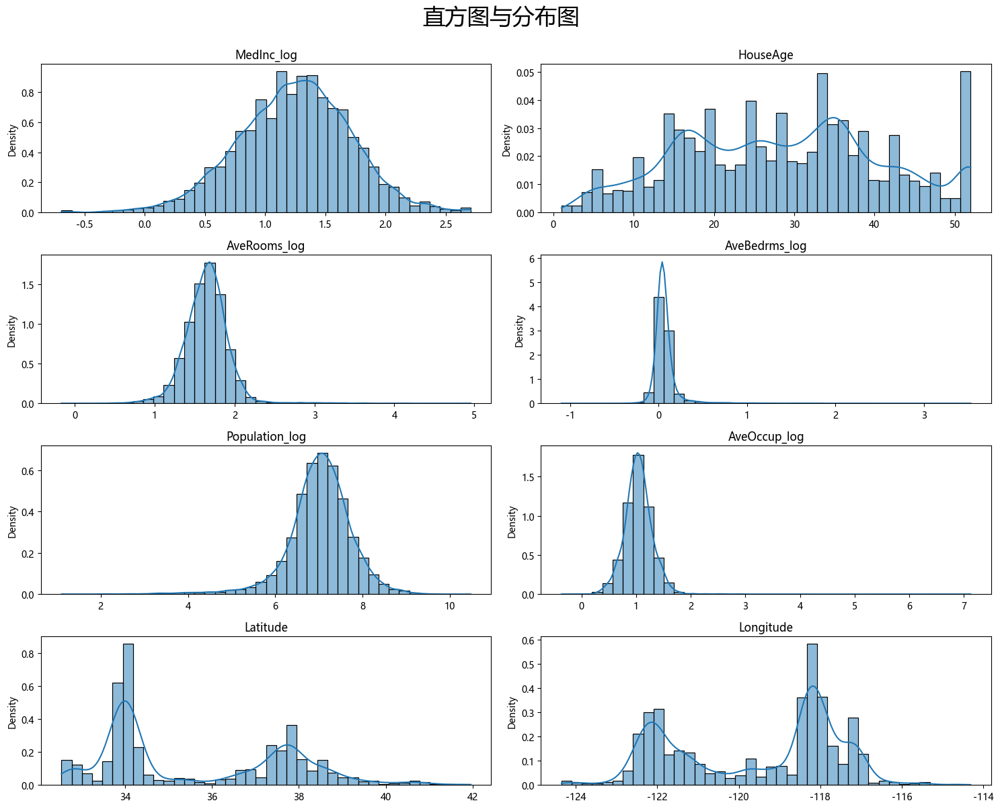
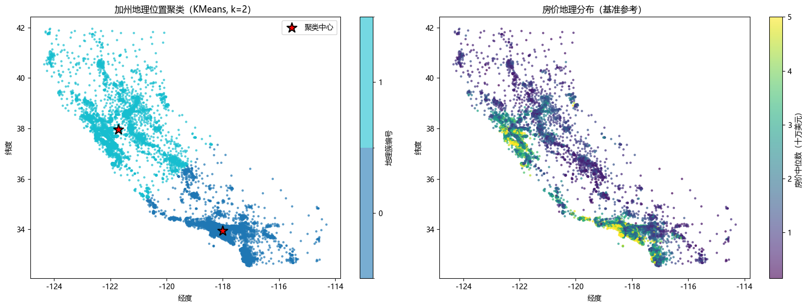

# 
加州房价数据集

# 
摘要

&emsp;基于scikit-learn里的加州房价数据集与 1AnalysisReport_v1.md 中的分析，进一步进行数据分析——自变量变换、直方图与分布图、标准化、基于自变量变换 OLS、剔除变量并变换因变量、基于自变量与因变量变换和剔除变量 OLS、特征衍生、基于自变量与因变量变换和剔除变量以及特征衍生 OLS。

# 
1 数据处理

&emsp;原解释变量的数据偏度和峰度都存在一定的问题，如下： 
| 特征 | skewness | kurtosis |
|:---:|:---:|:---:|
| MedInc | 1.646657 | 4.952524 |
| HouseAge | 0.060331 | -0.800629 |
| AveRooms | 20.697869 | 879.353264 |
| AveBedrms | 31.316956 | 1636.711972 |
| Population | 4.935858 | 73.553116 |
| AveOccup | 97.639561 | 10651.010636 |
| Latitude | 0.465953 | -1.117760 |
| Longitude | -0.297801 | -1.330152 |

&emsp;评估依据如下表所示：
| 指标 | 绝对值范围 | 严重程度 | 特征描述 | 常用数据处理方法 |
|:------:|:------------:|:----------:|:----------:|:--------------:|
| 偏度 | < 0.5 | 轻微（近似对称） | 分布基本对称，对多数模型影响小 | 可不处理，或使用 `sqrt(x)`、`log(x+c)` 等缓和变换 |
| 偏度 | 0.5 ~ 1.0 | 中度偏斜 | 明显不对称，可能影响均值的代表性 | 正偏：`log(x)`、`x^0.5`、`x^0.333` 等；负偏：先反射 `max(x)+1-x` 再做对数/平方根，或直接用 Yeo‑Johnson 变换 |
| 偏度 | > 1.0 | 严重偏斜 | 分布高度倾斜，线性模型误差项可能非正态 | 正偏：`log(x)`、`x^0.5`、Box‑Cox；负偏：反射变换或 Yeo‑Johnson；或改用非参数/稳健方法 |
| 超额峰度 | -1~1 | 轻微（接近正态峰） | 尾部厚度与正态分布相近 | 可忽略 |
| 超额峰度 | 1.0 ~ 3.0 或 -3.0 ~ -1.0 | 中等尖峰/厚尾 | 出现少量极端值，方差估计可能不稳 | 对数变换或 Box‑Cox 压缩厚尾；缩尾处理极端值；或使用稳健估计（如中位数、自助法置信区间） |
| 超额峰度 | > 3.0 或 < -3.0 | 严重尖峰/厚尾 | 长尾分布，离群值频发，标准误差膨胀 | 对数/Box‑Cox 变换；缩尾处理；分位数变换（Quantile Transformer）；或改用稳健模型/非参数方法 |

**注意**：超额峰度接近0为正态峰，显著<0（如<-1）为低峰（轻尾），在轻度范围内规则类似。重点关注正向超额峰度（厚尾）。 
&emsp;评估结果如下 
+ 轻微偏斜：HouseAge、Latitude、Longitude；严重偏斜：MedInc、AveRooms、AveBedrms、Population、AveOccup 
+ 轻微尖峰：HouseAge；中等尖峰：Latitude、Longitude；严重尖峰：MedInc、AveRooms、AveBedrms、Population、AveOccup 

&emsp;综上，HouseAge、Latitude、Longitude不处理（Latitude、Longitude地理位置信息存在交互效应暂不处理）；MedInc、AveRooms、AveBedrms、Population、AveOccup对数变换 

&emsp;根据变化后的直方图与分布图结果可以看到 HouseAge、Latitude、Longitude 这些没有变换的自变量分布图比较异常，其他的分布都趋向于正态分布。考虑到 HouseAge、Latitude、Longitude 本身的特殊性不进行进一步处理，后面只根据 Latitude、Longitude 构建衍生变量。另外，考虑到量纲不同，有些差异过大（尤其是 Latitude 和 Longitude 与其他变量差异过大），因此进行标准化

# 
2 线性回归模型

## 2.1 线性回归模型_v0
&emsp;将处理后的自变量与因变量扔到多元线性回归模型中看看效果：
模型摘要
| 指标 | 值 | 指标 | 值 |
|:---:|:---:|:---:|:---:|
| Dep. Variable: | MedHouseVal | R-squared: | 0.608 |
| Model: | OLS | Adj. R-squared: | 0.607 |
| Method: | Least Squares | F-statistic: | 3992. |
| Date: | Tue, 05 May 2026 | Prob (F-statistic): | 0.00 |
| Time: | 16:31:48 | Log-Likelihood: | -22590. |
| No. Observations: | 20640 | AIC: | 4.520e+04 |
| Df Residuals: | 20631 | BIC: | 4.527e+04 |
| Df Model: | 8 | | |
| Covariance Type: | nonrobust | | |

系数估计
| | coef | std err | t | P>\|t\| | [0.025 | 0.975] |
|:---:|:---:|:---:|:---:|:---:|:---:|:---:|
| const | 2.0686 | 0.005 | 411.004 | 0.000 | 2.059 | 2.078 |
| MedInc_log | 0.7480 | 0.008 | 89.426 | 0.000 | 0.732 | 0.764 |
| HouseAge | 0.1382 | 0.006 | 24.722 | 0.000 | 0.127 | 0.149 |
| AveRooms_log | -0.1047 | 0.009 | -11.413 | 0.000 | -0.123 | -0.087 |
| AveBedrms_log | 0.1517 | 0.007 | 21.381 | 0.000 | 0.138 | 0.166 |
| Population_log | 0.0024 | 0.005 | 0.438 | 0.661 | -0.008 | 0.013 |
| AveOccup_log | -0.2436 | 0.005 | -45.927 | 0.000 | -0.254 | -0.233 |
| Latitude | -0.9360 | 0.016 | -58.677 | 0.000 | -0.967 | -0.905 |
| Longitude | -0.8668 | 0.016 | -55.781 | 0.000 | -0.897 | -0.836 |

诊断检验
| 指标 | 值 | 指标 | 值 |
|:---:|:---:|:---:|:---:|
| Omnibus: | 3875.248 | Durbin-Watson: | 0.952 |
| Prob(Omnibus): | 0.000 | Jarque-Bera (JB): | 10219.510 |
| Skew: | 1.022 | Prob(JB): | 0.00 |
| Kurtosis: | 5.776 | Cond. No. | 6.51 |

**注意：**  
[1] 标准误假设误差的协方差矩阵被正确指定。 
&emsp;结果解析：
+ **R-squared** = 0.608：模型解释了目标变量（房价中位数）约 60.8% 的波动；**F-statistic** = 3992, P=0.000：模型整体是非常显著的；**AIC、BIC** 过高，相比于将所有自变量与因变量扔到多元线性回归模型中降低了一些
+ 只有 **Population_log** 不显著，这意味着在控制了收入、房间数、 occupancy 等因素后，单纯的人口数量对房价没有直接的线性解释力；**正向**：**MedInc_log**（收入越高房价越高，这是最强的预测因子）、**HouseAge**（房龄越老房价越高？这点值得注意，见下文）、**AveBedrms_log**（卧室越多房价越高）；**负向**：**Latitude、Longitude**（地理位置效应）、**AveRooms_log**（房间越多房价反而越低？）、**AveOccup_log**（居住密度越高房价越低）。
+ **Omnibus** = 3875.248，**Prob(Omnibus)** = 0.000表明残差不服从正态分布；**Skew** = 1.022表明残差分布明显右偏，不符合正态分布的对称性；**Kurtosis** = 5.776表明残差分布具有很厚的尾部，存在较多异常值；**DW** = 0.952表明残差显著正自相关——残差与滞后一期残差正相关；**JB** = 10219.510，**Prob(JB)** = 0.00表明残差不服从正态分布；**Cond. No.** = 6.51 表明模型非常稳定，没有多重共线性问题。

&emsp;综上，后续实验考虑
+ 剔除 Population 及其衍生 Population_log
+ 因变量进行对数变换

## 2.2 线性回归模型_v1
&emsp;剔除变量 Population_log 并变换因变量，线性回归结果如下：
| 指标 | 值 | 指标 | 值 |
|:---:|:---:|:---:|:---:|
| Dep. Variable: | MedHouseVal | R-squared: | 0.673 |
| Model: | OLS | Adj. R-squared: | 0.673 |
| Method: | Least Squares | F-statistic: | 6056. |
| Date: | Tue, 05 May 2026 | Prob (F-statistic): | 0.00 |
| Time: | 16:31:49 | Log-Likelihood: | -6129.1 |
| No. Observations: | 20640 | AIC: | 1.227e+04 |
| Df Residuals: | 20632 | BIC: | 1.234e+04 |
| Df Model: | 7 | | |
| Covariance Type: | nonrobust | | |

系数估计
| | coef | std err | t | P>\|t\| | [0.025 | 0.975] |
|:---:|:---:|:---:|:---:|:---:|:---:|:---:|
| const | 0.5720 | 0.002 | 252.294 | 0.000 | 0.568 | 0.576 |
| MedInc_log | 0.3871 | 0.004 | 102.936 | 0.000 | 0.380 | 0.395 |
| HouseAge | 0.0399 | 0.002 | 16.532 | 0.000 | 0.035 | 0.045 |
| AveRooms_log | -0.0832 | 0.004 | -20.277 | 0.000 | -0.091 | -0.075 |
| AveBedrms_log | 0.0866 | 0.003 | 27.116 | 0.000 | 0.080 | 0.093 |
| AveOccup_log | -0.1068 | 0.002 | -45.634 | 0.000 | -0.111 | -0.102 |
| Latitude | -0.5650 | 0.007 | -78.860 | 0.000 | -0.579 | -0.551 |
| Longitude | -0.5171 | 0.007 | -74.006 | 0.000 | -0.531 | -0.503 |

诊断检验
| 指标 | 值 | 指标 | 值 |
|:---:|:---:|:---:|:---:|
| Omnibus: | 1785.662 | Durbin-Watson: | 1.041 |
| Prob(Omnibus): | 0.000 | Jarque-Bera (JB): | 10481.769 |
| Skew: | 0.185 | Prob(JB): | 0.00 |
| Kurtosis: | 6.472 | Cond. No. | 6.40 |

**注意：**  
[1] 标准误假设误差的协方差矩阵被正确指定。

&emsp;结果解析：
| 指标 | 上一版 (Y原始值) | 这一版 (Y对数变换) | 解读 |
| :---: | :---: | :---: | :---: |
| **R-squared** | 0.608 | 0.673 | 解释力大幅提升。对 Y 取对数后，模型能解释房价波动的 67.3%，这在横截面数据中是非常高的分数。 |
| **Skew** (偏度) | 1.022 | 0.185 | 残差接近正态分布。从 1.0 降到 0.18，说明残差的分布形态变得非常漂亮，基本满足线性回归的假设。 |
| **AIC** | 4.52e+04 | 1.227e+04 | 模型拟合优度极佳。AIC 越低越好，数值大幅下降说明模型在惩罚参数后依然拟合得更好。 |
| **Population** | P=0.661 (不显著) | 已剔除 | 决策正确。去掉了噪音变量，模型更简洁有效。 |

&emsp;现在的模型变成了 Log-Log 模型（部分变量）或 Lin-Log 模型，这意味着系数的解释方式变了，变得更符合经济学直觉： 
**MedInc_log** (系数 0.3871)：弹性系数，在保持其他条件不变的情况下，收入每增加 1%，房价平均上涨约 0.39%；**AveOccup_log** (系数 -0.1068)，居住密度每增加 1%（更拥挤），房价平均下跌约 0.11%，反映了人们对居住空间的追求；**HouseAge** (系数 0.0399)是 Lin-Log 关系（Y是对数，X是原始值），X 每增加 1 个单位（1年），Y 变化 0.0399 ×100%≈4%，房龄每增加 1 年，房价平均上涨约 4%，这依然反映了“地段折旧”效应，即老房子通常占据更好的地段，地段的增值超过了房子的物理折旧；**Latitude & Longitude** 系数依然显著为负，说明地理位置依然是决定房价的基础框架。 

&emsp;依然存在的问题（但已改善）： 
**Durbin-Watson** = 1.041，虽然比之前的 0.952 有所提升，但依然远小于 2，空间自相关依然存在。这意味着“邻居还是影响邻居”，对于线性回归来说，这已经是极限了。除非使用空间计量模型（如空间滞后模型），否则很难消除。但在实际应用中，这个 DW 值是可以接受的，只要知道标准误可能偏小即可；**Kurtosis** (峰度) = 6.472，虽然偏度解决了，但峰度依然较高（正态分布应为 3），残差分布依然是“尖峰”的，意味着还有一些极端值（极贵或极便宜的房子）模型没能完美覆盖。不过相比偏度问题，峰度问题的影响较小。

&emsp;综上，后续实验考虑
+ 纳入 Latitude 与 Longitude 的衍生变量

&emsp;根据经纬度对原数据进行 Kmeans 聚类，对比可得按照经纬度聚类，聚类中心个数为 2 时划分效果最好。按照聚类分类结果以及聚类中心的位置计算各地理类别到聚类中的位置构造**地理距离**特征作为新的特征，使用 Haversine 球面距离（单位：公里）来构建距离特征。

## 2.3 线性回归模型_v2
&emsp;相比于线性回归模型_v1：增加基于经纬度聚类中心的距离衍生特征，整体的 OLS 的结果类似。衍生特征 **dist_to_center_km** 显著，**R-squared**（=0.692） 提高0.019；**F-statistic**值降低但模型整体仍显著（p=0.00）；**AIC/BIC** 显著降低。线性回归结果如下：
| 指标 | 值 | 指标 | 值 |
|:---:|:---:|:---:|:---:|
| Dep. Variable: | MedHouseVal | R-squared: | 0.692 |
| Model: | OLS | Adj. R-squared: | 0.692 |
| Method: | Least Squares | F-statistic: | 5807. |
| Date: | Tue, 05 May 2026 | Prob (F-statistic): | 0.00 |
| Time: | 16:31:54 | Log-Likelihood: | -5483.9 |
| No. Observations: | 20640 | AIC: | 1.099e+04 |
| Df Residuals: | 20631 | BIC: | 1.106e+04 |
| Df Model: | 8 | | |
| Covariance Type: | nonrobust | | |

系数估计
| | coef | std err | t | P>\|t\| | [0.025 | 0.975] |
|:---:|:---:|:---:|:---:|:---:|:---:|:---:|
| const | 0.5720 | 0.002 | 260.299 | 0.000 | 0.568 | 0.576 |
| MedInc_log | 0.3461 | 0.004 | 90.721 | 0.000 | 0.339 | 0.354 |
| HouseAge | 0.0219 | 0.002 | 9.169 | 0.000 | 0.017 | 0.027 |
| AveRooms_log | -0.0490 | 0.004 | -11.998 | 0.000 | -0.057 | -0.041 |
| AveBedrms_log | 0.0744 | 0.003 | 23.886 | 0.000 | 0.068 | 0.080 |
| AveOccup_log | -0.1141 | 0.002 | -50.098 | 0.000 | -0.119 | -0.110 |
| Latitude | -0.5164 | 0.007 | -73.026 | 0.000 | -0.530 | -0.503 |
| Longitude | -0.4858 | 0.007 | -71.154 | 0.000 | -0.499 | -0.472 |
| dist_to_center_km | -0.0944 | 0.003 | -36.484 | 0.000 | -0.100 | -0.089 |

诊断检验
| 指标 | 值 | 指标 | 值 |
|:---:|:---:|:---:|:---:|
| Omnibus: | 2051.627 | Durbin-Watson: | 1.027 |
| Prob(Omnibus): | 0.000 | Jarque-Bera (JB): | 12322.992 |
| Skew: | 0.283 | Prob(JB): | 0.00 |
| Kurtosis: | 6.743 | Cond. No. | 6.64 |

**注意：**  
[1] 标准误假设误差的协方差矩阵被正确指定。

